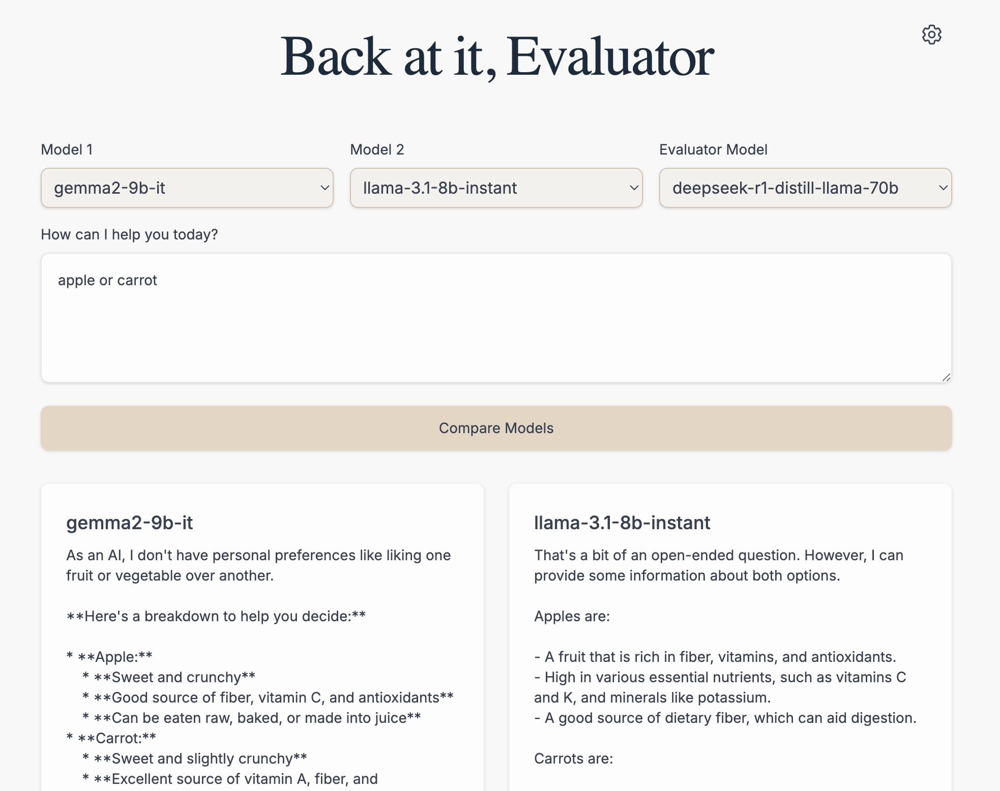

# 🚀 [Groq - Evals](groq-evals.vercel.app)
<div align="center">
  
  
  <p align="center">
    <strong>Compare and evaluate different Groq models with ease</strong>
  </p>
</div>

## 🌟 Overview

Groq Model Evaluator is a powerful web application that allows you to compare and evaluate different Groq language models side by side. Built with Next.js and FastAPI, it provides an intuitive interface for testing model performance, analyzing responses, and making data-driven decisions about which model best suits your needs.

### ✨ Key Features

- 🔄 Side-by-side model comparison
- 🤖 Automated reasoning about model performance
- 🎨 Beautiful, responsive UI
- 🔑 Secure API key management
Yet to come:
- 📈 Visual metric representations
- 📊 Comprehensive evaluation metrics
- 🎯 Semantic similarity analysis

## 🚀 Getting Started

### Prerequisites

- Python 3.8+
- Node.js 18+
- Groq API key ([Get one here](https://console.groq.com/keys))

### Installation

1. Clone the repository:
```bash
git clone https://github.com/yourusername/groq-evals.git
cd groq-evals
```

2. Install backend dependencies:
```bash
cd backend
python -m venv venv
source venv/bin/activate  # On Windows: .\venv\Scripts\activate
pip install -r requirements.txt
```

3. Install frontend dependencies:
```bash
cd frontend
npm install
```

### Configuration

1. Create a `.env` file in the backend directory:
```env
AVAILABLE_MODELS=["gemma2-9b-it", "llama-3.1-8b-instant", "mixtral-8x7b-32768"]
EVALUATION_MODELS=["deepseek-r1-distill-llama-70b"]
```

### Running the Application

1. Start the backend server:
```bash
cd backend
uvicorn app.main:app --reload
```

2. Start the frontend development server:
```bash
cd frontend
npm run dev
```

3. Open [http://localhost:3000](http://localhost:3000) in your browser

## 📊 Features

### Model Comparison
- Compare responses from different Groq models side by side
- Automatic evaluation of response quality
- Detailed reasoning for model selection


## 🤝 Contributing

We welcome contributions! Here's how you can help:

1. Fork the repository
2. Create a feature branch:
```bash
git checkout -b feature/amazing-feature
```

3. Commit your changes:
```bash
git commit -m 'Add amazing feature'
```

4. Push to your branch:
```bash
git push origin feature/amazing-feature
```

5. Open a Pull Request

### Development Guidelines

- Follow the existing code style
- Add comments for complex logic
- Update documentation as needed
- Add tests for new features
- Ensure all tests pass before submitting PR

## 📝 License

This project is licensed under the MIT License 

## 🙏 Acknowledgments

- [Groq](https://groq.com) for their amazing API
- The open-source community for inspiration and tools
- All contributors who help improve this project

## 📬 Contact

Have questions? Need help? Feel free to:
- Open an issue
- Start a discussion
- Reach out to maintainers

---

<div align="center">
  Made with ❤️ by Adi
</div> 
